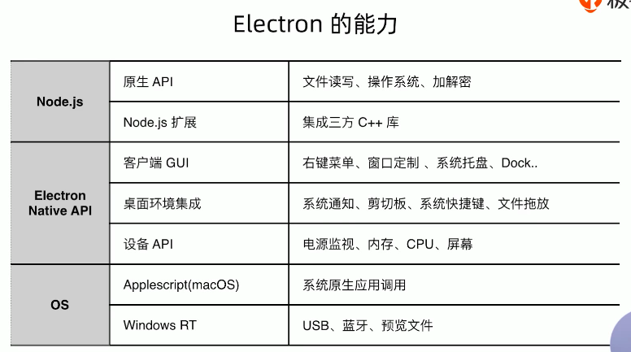

## 1. 主进程

- Electron运行package.json的main脚本的进程被称为主进程
- 每个应用只有一个主进程
- 管理原生GUI，典型的窗口（BrowserWindow、Tray、Dock、Menu）
- 创建渲染进程
- 控制应用生命周期（app）

## 2. 渲染进程

- 展示Web页面的进程称为渲染进程
- 通过Node.js、Electron提供的API可以跟系统底层打交道
- 一个Electron应用可以有多个渲染进程

## 3. 进程间通信

目的

- 通知事件
- 数据传输
- 共享数据

### 3.1 IPC模块通信

- Electron提供了IPC通信模块，主进程的ipcMain和渲染进程的ipcRenderer
- ipcMain、ipcRenderer都是EventEmitter对象

### 3.2 从渲染进程到主进程

Promise写法：

- ipcRenderer.invoke.(channel, ..args)
- ipcMain.handle(channel, handler)

### **3.3 从主进程到渲染进程**

- ipcRenderer.on(channel, handler)
- webContents.send(channel)

### 3.4 页面间（渲染进程与渲染进程间）通信

- 通知事件
  - ipcRenderer.sendTo（Electron 5之后）
- 数据共享
  - Web技术（localStorage、sessionStorage、indexedDB）
  - 使用remote（不推荐）

经验&技巧

- 少用remote模块
- 不要用sync模式
- 在请求+响应的通信模式下，需要自定义超时限制

## 4. Electron原生能力

- Native API
- Node.js
  - Api
  - binding
  - child_process

### 4.1 创建原生GUI

### 4.2 获得底层能力

### 4.3 使用Node.js调用原生模块

## 5. 释放想象力，基于Electron可以做什么？

### 5.1 无兼容问题

- 不用担心在Safari、IE上的变现差异了
- 大胆使用Chrome浏览器已经支持的API
- babel中设置targets为Electron对应的Chrome版本

### 5.2 最新浏览器Feature

https://developers.google.com/web/updates

举个例子：

- 纯天然LazyLoad（https://mathiasbynens.be/demo/img-loading-lazy）

### 5.3 ES6/7/8/9/10高级语法

### 5.4 无跨域问题

- 使用Node.js发送请求
- 使用Electron net发送请求

### 5.5 More...

- 操作本地文件
- 更好用的本地DB，如：Lowdb、Leveldb等等
- 多线程、多进程并行

