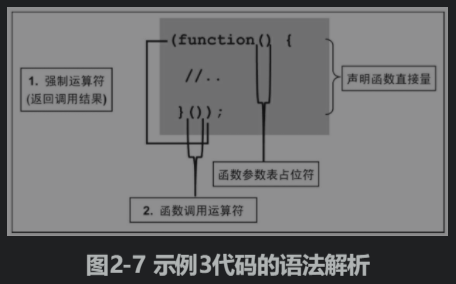
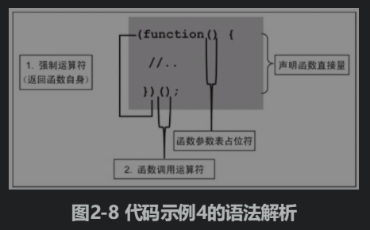
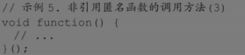
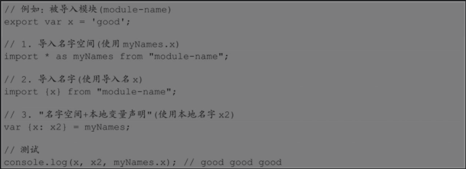

### 2.1 语法综述

#### 2.1.1 标识符所绑定的语义

所谓声明，即约定数据的生存周期和逻辑的作用域。编程的过程，其实被解释成了“说明逻辑和数据”的过程。

#### 2.1.2 识别语法错误与运算错误

### 2.2 JavaScript的语法：声明

#### 2.2.1 变量的数据类型

7种基本数据类型：

| 类型      | 含义   | 说明                                               |
| --------- | ------ | -------------------------------------------------- |
| undefined | 未定义 | 值类型                                             |
| number    | 数值   | 值类型                                             |
| string    | 字符串 | 值类型，字符串在赋值运算中会按引用类型的方式来处理 |
| boolean   | 布尔值 | 值类型                                             |
| symbol    | 符号   | 值类型，符号是一种与对象有些相似的值类型数据       |
| function  | 函数   | 引用类型                                           |
| object    | 对象   | 引用类型                                           |

##### 2.2.1.1 基本数据类型

任何一个变量或值的类型都可以（而且应当首先）使用typeof运算得到。

##### 2.2.1.2 宿主定义的其他对象类型

ECMAScript规范接受（但不推荐）typeof返回上述7中类型之外的值。

##### 2.2.1.3 值类型与引用类型

- 一般表达式运算的结果总是值
- 函数/方法调用的结果可以返回值类型或者引用。
- 值与引用、值与值之间即使相等（==），也不一定严格相等（===）。
- 两个引用之间如果相等（==），则一定严格相等（===）。

##### 2.2.1.4 讨论：ESMAScript的类型系统

ESMAScript语言类型的存在，就是为了撰写ESMAScript规范本身，以明确叙述该语言的规范。然而ESMAScript规范中描述的语言——严格意义上并不是JavaScript语言（注：在这个语境下，JavaScript是ECMAScript的一种方言。如同四川话是汉语的一种方言一样，我们总不能因此说汉语就是四川话）——存在7中数据类型，包括Undefined、Null、Boolean、String、Symbol、Number和Object。这些数据类型与JavaScript对数据类型的决定有如下三点不同：

- ECMAScript语言类型用首字符大写的单词作为类型名，例如Undefined；而JavaScript语言类型使用字符串作为类型名，且首字符小写。
- ECMAScript语言类型中的Null是一个类型，并且有一个唯一值null；而在JavaScript语言类型中没有Null类型，null值是对象类型的一个特殊实例。
- ECMAScript语言类型中没有函数类型，函数是对象类型的一个变体（Exotic Object），即对象类型的一种实现；而JavaScript语言类型中函数是第一类类型（First class type），即能用typeof关键字检查的、与string、object等同级别的基本类型。

ECMAScript规范类型是为了实现ECMAScript语言类型而存在的。

ECMAScript语言类型是为了叙述JavaScript语言的规范而存在的。

#### 2.2.2 变量声明

- 显示声明
- 隐式声明（即用即声明）

隐式声明发生在一般的赋值语句中。

##### 2.2.2.1 块级作用域的变量声明与一般var声明

除了以下三点不同，let的语法以及使用场景都与var一致：

- var声明的变量，其作用域为当前函数、模块或全局；let声明的变量，其作用域总是在当前的代码块，例如语句块。
- 在同一个代码块中，可以用var来多次声明变量名，这在语法分析中与声明一次没有区别；而用let却只能声明一次，覆盖一个已经声明的let变量（或者用let去覆盖一个已声明过的标识符）会导致语法错误。
- 用户代码可以在声明语句之前使用所声明的var变量，这是该变量的值是undefined；而let声明的变量必须先声明后使用，声明语句之前的代码引用了let变量会触发异常，这也会导致typeof成为一个不安全的运算。

let声明与其他一些较新的语法元素遵从“块级作用域”规则，因此即使出现在全局代码块中，他们也只是声明为“全局作用域”中的标识符，而不作为对象global上的属性。

##### 2.2.2.2 用赋值模板声明一批变量

在赋值模板中可以使用剩余参数语法来声明数组或对象。

#### 2.2.3 使用字面量风格的值

在声明中，等号右边既可以是表达式——这意味着将表达式运算的结果作为该变量的初值，也可以是更为强大和灵活的字面量声明。

##### 2.2.3.1 字符串字面量、转义符

转义符主要用于在字符串中包含控制字符，以及当前操作系统语言和字符集中不能直接输入的字符；转义符总是用一个反斜线字符“\”引导。

除了定义转义符之外，当反斜线字符“\”位于一行的末尾（其后立即是代码文本中的换行）时，也用于便是连续的字符串声明。这在声明大段文本块时很有用。

比较容易被忽视的是，空字符串与其他字符串一样也可以用作对象成员名。

##### 2.2.3.2 模板字面量

本质上，这里的“${...}”就是用来捕获表达式值的，而所谓变量（以及字面量等）不过是单质表达式，而对象属性就是对象成员存取运算表达式。

模板字面量本质上来说是一个字面量的引用——该字面量在JavaScript内部表达为一个对象（array-like object）或数组。

##### 2.2.3.3 数值字面量

当一个字面量被识别为十进制整型数时，它内部的存放格式可能是浮点数，也可能是整型数，这取决于不同引擎的实现。

#### 2.2.4 其他声明

##### 2.2.4.1 常量声明

准确的说，常量的标识符不能再绑定到其他的数据。

##### 2.2.4.2 符号声明

符号没有字面量声明形式。

##### 2.2.4.3 函数声明

在JavaScript中，函数是一种数据类型，所以函数声明是变量声明的一种特殊形式。

严格来说，匿名函数（已经箭头函数）是一个函数字面量值，而不是函数声明。

所谓形式参数，是指可以在函数体内部使用的、有效的标识符名。可以声明零至多个形式参数，即使在函数体内部并不使用他们。或者也可以不声明形式参数，这时也可以在函数体内使用一个名为arguments的内部对象来存取函数调用时的传入值。

在ES5以后的规范中，明确规定了在表达式中出现的具名函数名只影响该函数内的代码，而不会影响该变大时所在的作用域。

如果默认值并没有放在参数列表的尾部，n那么可以使用undefined，在传参时表明该参数使用默认值。

使用class关键字来声明的类，也是一个函数。因此可以将类声明理解为函数声明的一种特殊语法。

### 2.3 JavaScript的语法：表达式运算

相较于其他语言，JavaScript在运算符上有一种特殊性：许多语句/语法分隔符也同时是运算符——他们的含义当然是不同的。

在JavaScript中，运算符大多数是特殊符号，但也有少量单词。如下：

typeof、void、new、in、instanceof、delete、yield、await

表达式由运算符与操作数构成。操作数除了包括变量，还包括函数（或方法）的返回值，此外也包括字面量。但JavaScript中也可以存在没有运算符的表达式，这称为“单值表达式”。单值表达式有值的含义，表达式的结果即是该值，主要包括：

- this、super、new.target和arguments引用。
- 变量引用。即一个已声明的标识符。
- 字面量，包括null、undefined、字符串、布尔值、数值、模板、正则表达式。

在ES6中，将下面几种表达式与单值表达式一起成为基本表达式：

- 数组字面量，即[...]
- 对象字面量，即{...}
- 函数字面量，包括一般匿名函数、箭头函数、类和生成器等。
- 表达式分组运算，即(...)

JavaScript的表达式总有结果值——一个值类型或引用类型的数据，或者undefined。

表达式运算的本质目的还是求值，而非表达逻辑。

#### 2.3.1 一般表达式运算

##### 2.3.1.1 逻辑运算

JavaScript还包括另外一种逻辑运算，包括“逻辑或（||）”和“逻辑与（&&）”两种运算，他们的表达式结果类型是不确定的。不过他们的使用方法与运算逻辑都与基本的布尔运算一致。

这两个运算符（||与&&）既不改变操作数的数据类型，也不强制运算结果的数据类型。

事实上，纯布尔值运算是逻辑运算的一个特例。

##### 2.3.1.2 字符串运算

一个带有符号“+”的表达式是不是“字符串连接”运算，取决于它在运算时存在几个操作数，以及每个操作数的类型。

字符串连接运算符总是产生一个新的字符串，它在运算效果（结果值）上完全等同于调用字符串对象的concat()方法。

##### 2.3.1.3 数值运算

“一般表达式运算”既包括“加减乘除”等一般性的数值运算，有包括数值的位运算。

一般表达式运算总是能成功地应用与所有的数据类型，而其结果也总是能表达为数值或布尔值。

#### 2.3.2 比较运算

##### 2.3.2.1 等值检测

等值检测中“相等”的运算规则如下表：

| 类型                     | 运算规则                                                     |
| ------------------------ | ------------------------------------------------------------ |
| 值类型与引用类型进行比较 | 将引用类型的数据转换为与值类型数据相同的数据，再进行“数据相等”比较 |
| 两个值类型进行比较       | 转换成相同数据类型的值进行“数据等值”比较                     |
| 两个引用类型进行比较     | 比较引用（的地址）                                           |

在三种值类型（数值、布尔值和字符串）中，如果两个被比较的值类型不同，那么：

- 有任何一个是数字时，会将另一个转换为数字进行比较；或，
- 有任何一个是布尔值时，它将被转换为数字进行比较（并且由于上一规则的存在，所以另一个数据也将被转换为数字）；或
- 有任何一个是对象（或函数）时，将调用该对象的valueOf()方法来将其转换为值数据进行比较，且在多数情况下该值数据作为数字值处理；或
- 按照特定规则返回比较结果，例如，undefined与null值总是相等的。

**JavaScript总是尽量用数字值比较来实现等值检测，这主要是因为JavaScript内部的数据存储格式适合这一操作。**

在等值检测运算中存在一些特例，包括：

1. NaN不等于自身
2. 符号可以转换为true，但不等值与true
3. 即使字面量相同的引用类型，也是不严格相等的
4. 当等值检测中有任何一个数据是符号时，该符号无须进行任何数据转换，因为它总是不等于任何其他数据。

##### 2.3.2.2 序列检测

从数学概念来说，实数数轴上可比较的数字式无限的（正无穷到负无穷）。该数轴上的有序类型只是该无限区间上的一些点。但对于具体的语言来说，由于数值的表达范围有限，所以数值的比较也是有限的。因此，如果一个数据的值能投射（例如，通过类型转换）到该轴上的一个带你，则它可以参与该轴所表达范围内的序列检测：即比较其序列值的大小。

序列检测的含义在于比较变量在序列中的大小，即数学概念中的数轴上点的位置先后。有：

< <= > >=四种。

**序列检测的运算规则如下表**

| 类型                     | 运算规则                                                     |
| ------------------------ | ------------------------------------------------------------ |
| 两个值类型进行比较       | 直接比较数据在序列中的大小                                   |
| 值类型与引用类型进行比较 | 将引用类型的数据转换为值类型数据相同的数据，再进行“序列大小”比较 |
| 两个引用类型进行比较     | 无意义，总是返回false                                        |

所谓字符串的序列检测，在具体实现上是有限制的：

- 当两个操作数都是字符串时，4个运算符才表示字符串序列简则，否则，
- 当任意一个操作数是非字符串时，会将字符串转换为数值来参与运算。

#### 2.3.3 赋值运算

在JavaScript中，赋值是一个运算而不是一个语句，所以在赋值表达式中，运算符左右都是操作数。当然，按照“表达式”的概念，表达式的操作数既可以是值（包括字面量）也可以是引用。

##### 2.3.3.1 赋值的语义

赋值运算对值类型来说是复制数据，而对于引用类型来说，则只是复制一个地址。

但这里存在两个特例。其一，值类型的字符串是一个大的、不确定长度的连续数据块，这导致复制数据开销很大，所以在JavaScript中将字符串的复制也变成了复制地址——该字符串（连续数据块起始处）的地址引用。由此引入了三条字符串处理的限制：

- 不能直接修改字符串中的字符。
- 字符串连接运算必然导致写复制，浙江产生新的字符串。
- 不能改变字符串的长短。

其二，在ES6之后的结构赋值中，赋值运算符的语义并不只有“复制地址/复制引用”，还包括“解析数组或对象的成员”这一行为。

##### 2.3.3.2 复合赋值运算符

##### 2.3.3.3 解构赋值

这个操作用于将数组或对象成员的值按照语法规则成批地赋值给左侧的操作数，并且支持桥涛和成员属性的深度遍历。

#### 2.3.4 函数相关的表达式

##### 2.3.4.1 匿名函数与箭头函数

匿名函数可以作为字面量直接参与表达式运算——而不需要引用它的名字。

##### 2.3.4.2 函数调用

##### 2.3.4.3 new运算

使用class声明的类也将是一个函数（构造器），但它只能被new运算符调用。

严格来说，在`new functionReference()`语法中functionReference后面的括号并不是函数调用运算符，而只是new 运算符语法的参数传入表——这是因为，在这一语法中决定（或启动）函数调用的是new运算符而非这对括号。

#### 2.3.5 特殊作用的运算符

##### 2.3.5.1 类型运算符（typeof）

注意，这里的typeof是运算符，而不是语句的语法关键字。之所以说它是特殊作用的运算符，是因为在其他运算中，变量是以其值参与运算的。

##### 2.3.5.2 展开语法（spread syntex）

##### 2.3.5.3 面向表达式的运算符

#### 2.3.6 运算符的优先级

### 2.4 JavaScript的语法：语句

语句两个原则：

- 语句由语法符号“;（分号）”来分隔。
- 一些语句存在返回值。

标签不是语句，标签化语句是特殊性质的语句语法（标签化只带来语法效果，并被特定的语句子句识别）。标签本身不是语句或Tokens词法元素。

#### 2.4.1 表达式语句

表达式语句表明：“只有表达式，而没有其他语法元素的语句”。

##### 2.4.1.1 一般表达式语句

单值表达式语句可用于远程读取数据。

空语句“;”在JavaScript中，它是无值的。

当使用eval()执行一批语句时，将返回“最后执行到的、有返回值的”那条语句的值。

在代码中使用空语句时一定要准确地添加注释，尤其是用来写空循环或者空分支时，如果没有注释就会出现非常糟糕的代码风格。

##### 2.4.1.2 赋值语句与隐式的变量声明

赋值表达式一方面可以继续参与运算，一方面，也可以直接加上一个语句结束符“;”，以表明这是一个“表达式语句”。

##### 2.4.1.3 函数调用语句

JavaScript的函数本身是一个变量/值，因此函数调用其实是一个表达式。

匿名函数调用的三种方式如下：

上述两种表达式的运算过程是不同的：在示例3中，用分组运算符使函数调用运算符得以执行；在示例4中，用分组运算符使“函数字面量”这个表达式求值，并返回一个函数自身的引用，让后通过“()”来操作这个函数引用。换言之，“函数调用运算符()”在示例3中用于匿名函数本身，在示例4中却作用于一个运算的结果值。

运算符void用于使其后的函数作为表达式执行。

#### 2.4.2 变量声明语句

语句“变量声明+赋值语句”是在两个不同阶段中处理的。`var str = 'test string';`其中，`var str`作为变量声明在语法解析阶段就被处理，使执行环境中有了名为str的变量；`str = 'test string'`在执行阶段处理，通过赋值操作向变量名str绑定具体的值。

#### 2.4.3 分支语句

##### 2.4.3.1 条件分支语句（if语句）

if ... else if ...这样的格式并非是“一种语法的变种”。只不过else子句中的statement2是一个新的、单行的if语句而已。

##### 2.4.3.2 多重分支语句（switch语句）

#### 2.4.4 循环语句

在循环体中，是可以使用空语句的，但通常除了展示技巧之外并无益处。

#### 2.4.5 流程控制：一般子句

##### 2.4.5.1 标签声明

JavaScript中的标签就是一个标识符。

标签在语义上用于标识一个“语句/语句块”的范围。这个方位是指单一语句的开始到结束位置（分号、行末或文末结束符），或者成批语句的开始到结束位置（一对大括号）。

##### 2.4.5.2 break子句

尽管不太常见，但default分支中的break在某些情况下确实是有价值的。

##### 2.4.5.3 continue子句

continue不允许跳转到“当前/外层的单个循环语句的起始“之外的其他任何地方。

##### 2.4.5.4 return子句

#### 2.4.6 流程控制：异常

catch(){...}和finally{...}块都是可选的，但必须至少存在一个。

finally{...}语句块的一个重要之处在于它总是在try/catch块退出之前被执行。

throw语句后“应当是”一个错误对象：Error()构造器的实例，或通过“catch(exception)”子句中捕获到的异常exception。之所以说“应当是”，是因为throw语句其实可以将任何对象/值作为异常抛出。

### 2.5 JavaScript的语法：模块

JavaScript语言先于ECMAScript规范具备了组织更大规模系统开发的能力。

#### 2.5.1 模块的声明与加载

##### 2.5.1.1 加载模块

装载模块意味着模块中的顶层代码会被执行一次，由于引擎的模块装载系统会静态扫描全部模块并确定装载的次序，所以事实上模块名在“import”语句中出现和被依赖的次序也就成了那些顶层代码得以执行的次序。

##### 2.5.1.2 声明模块

也可以将export语句自身理解为声明语句。这能准确反映它是“（静态的）语法分析阶段”就得到处理的事实。

#### 2.5.2 名字空间的特殊性

名字空间对象的原型式null。

##### 2.5.2.1 名字空间的创建者

主模块根本没有自己的名字空间。

除了这个特例，其他的模块都在他们被import导入的时候，由JavaScript引擎为之创建了一个对应的名字空间对象。

##### 2.5.2.2 名字空间中的名字是属性名

不同于导入名，名字空间中的名字其实是属性名，可以像对象属性一样操作。

##### 2.5.2.3 使用上的一些特殊性

导入名先于代码执行被创建，因此它可以提前执行。

三种存取方式：

在方法2中，x是当前摩卡中的一个本地名字，它被创建为所谓的“非可变间接绑定（immutable indirect binding）”，并关联到目标模块module-name中的对应导出项。这决定了该本地名字跟常量是类似的、是不可写的。读的是源模块的引用，写的是本地的名字。

### 2.6 严格模式下的语法限制

如下情况下的代码默认处于严格模式中：

- 模块中。
- 类声明和类表达式的整个声明块中。
- 在引擎或宿主的运行参数中指定，例如：`node --use_strict`

#### 2.6.1 语法限制

总的来说，有七种语法在严格模式中被禁用：

1. 在对象字面量声明汇总存在相同的属性名，自ES6开始该限制就被取消了。
2. 在函数声明时，参数表中带有相同的参数名。
3. 不能声明或重写eval和arguments这两个标识符。
4. 用0前缀声明的八进制字面量。
5. 用delete删除显示声明的标识符、名称或具名函数。
6. 在代码汇总使用一些保留字，这些保留至包括implements、interface、let、package、private、protected、public、static以及yield。
7. 在代码中包括with语句。

#### 2.6.2 执行限制

1. 在严格模式下项不存在的标识符赋值将导致“引用异常”。
2. 运算符处理一些不可处理的操作数时，将导致“类型异常或语法错误”。
3. 访问arguments.callee或函数的caller属性将导致“类型异常（TypeError）”

#### 2.6.3 严格模式的范围

##### 2.6.3.1 有限范围下的严格模式

如果一段代码被标志为“严格模式”，则其中运行的所有代码都必然是严格模式下的。其一，如果在语法检测期发现语法问题，则整个代码块失效并导致一个语法异常；其二，如果在运行期出现了违法严格模式的代码，则抛出执行异常。

一个函数如果需要允许在严格模式下，则它的名字和参数的违例情况总会被检测。

#### 2.6.3.2 非严格模式的全局环境

在任何处于严格模式的代码中，JavaScript引擎都允许用户代码通过如下两种方式将代码执行在一个非严格模式的全局函数中：

- 使用间接调用的eval()函数
- 使用new Function方式创建的函数

### 2.7 运算符的二义性

#### 2.7.1 加号“+”的二义性

加号带来的主要问题与另一条规则有关。这条规则是“如果表达式中存在字符串，则优先按做父传连接进行运算”。

#### 2.7.2 括号“()”的二义性

#### 2.7.3 冒号“:”与标签的二义性

冒号的二义性问题集中在标签声明与对象成员声明的识别上。

#### 2.7.4 大括号“{}”的二义性

##### 2.7.4.1 复合语句/语句块

##### 2.7.4.2 声明对象字面量

##### 2.7.4.3 函数声明

##### 2.7.4.4 结构化异常

大括号在结构化异常中是语法符号，因此它不能用单行语句来替代。

##### 2.7.4.5 模板中的变量引用

模板在JavaScript中的语法“${...}”用于代替一个表达式，而它用作"${x}"这样的变量名时，只不过是将变量名引用理解为单值表达式（并计算返回该单值）而已。

##### 2.7.4.6 解构赋值

从语法设计的角度上来讲，赋值表达式左侧的运算数是一个引用，而右侧则是一个值。

赋值模板并不仅仅出现在赋值表达式的左侧，例如还可在函数的参数界面中。

#### 2.7.5 逗号“,”的二义性

逗号既可以是语法分隔符，又可以是运算符。

#### 2.7.6 方括号"[]"而二义性

- 方括号可以被理解为数组声明，或下标存取。
- 方括号还可以被理解为对象成员存取。
- 逗号可以被理解为语法分隔符，或连续运算符。

#### 2.7.7 语法设计中对二义性的处理

