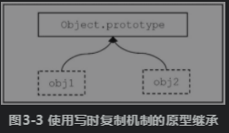
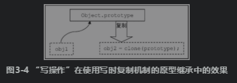
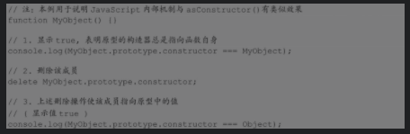

基于类的语言和程序设计技术也称为面向对象。

### 3.1 面向对象编程的语法概要

正则表达式字面量必须写在同一行。

#### 3.1.1 对象声明与实例创建

##### 3.1.1.1 使用构造器创建对象实例

语法如下：

```javascript
obj = new Constructor; // 和下面一行是等义的
obj = new Constructor();
obj = new Constructor(arg1[, arg2, ...]);
```

JavaScript将在构造器函数执行过程中传入new运算所产生的实例，并将该实例作为this对象引用传入。

也可以只将构造器作为普通函数来使用，例如下面的代码：

```javascript
function foo() {
    var data = this;
    return {};
}
obj = new foo();
```

在这里，最终obj也会被赋值为一个对象。但它并不是由new运算产生的对象实例，而是foo()函数中返回的对象字面量——注意，使用这种方法的时候，只能返回一个引用类型（对象、函数等），而不能是值类型数据——例如不能是true、'abc'之类。当用户试图返回值类型数据时，脚本引擎会忽略掉他们，仍然使用原来的this引用。

##### 3.1.1.2 声明对象字面量

##### 3.1.1.3 数组及其字面量

在数据结构的本质上并不具有某些多维数组的特性。

也可以使用数值字符串作为下标来访问数组成员，但这时在语义上却有所不同。这种情况下是将数组作为对象来进行“名-值”存取的。JavaScript中的数组既是下标存取的索引数组，也是支持属性存取的关联数组。

可迭代的对象不一定都是数组。

##### 3.1.1.4 正则表达式及其字面量

引用匹配`\nn`指在一个正则表达式中复用已通过“匹配分组”获取的、文本中的子字符序列。它的指定格式与“八进制ASCII字符”是冲突的。当发生歧义时，优先理解为“获取匹配”；若找不到足够的匹配个数，则理解为“八进制ASCII字符”。

##### 3.1.1.5 在对象声明中使用属性存取器

#### 3.1.2 使用类继承体系

所谓类继承，其实也是传统原型继承模式的一种表现方式。

##### 3.1.2.1 声明类和继承关系

下面三个声明在语义上是等价的：

```javascript
// 最简单的类声明
class MyObject {}

// 等价于（采用构造函数声明风格）
function MyObject() {}

// 等价于（采用变量声明风格）
var MyObject = new Function;
```

用extends声明的parentClass是一个表达式（的结果值），因此这事实上是说，该表达式将运行在严格模式中。

##### 3.1.2.2 声明属性

使用函数作为构造器时需要通过原型来声明对象实例的属性。

##### 3.1.2.3 调用父类构造方法

在默认情况下使用super()时，将会默认传入当前所构造的实例作为父类可以访问的this引用。

在使用this之前，总是需要先显式地调用super()以便在当前构造方法中获得this实例。

##### 3.1.2.4 调用父类方法

在使用super.XXX调用父类方法时也会隐式第传入当前的this引用，这与在构造器中调用super()时是一致的。

##### 3.1.2.5 类成员（类静态成员）

事实上，类静态成员也可以直接声明为“类/构造器函数”的成员。除了不能使用super之外（this当然也没有绑定到类），并没有特别的不同。

#### 3.1.3 对象成员

JavaScript中的对象是“属性包”，属性即所谓的对象成员。

对象成员可以是自有的（own properties），也可以是继承的（inherited properties）。所谓继承的，是指对象的父类或祖先类原型（即该对象的原型链上）具有该成员；子类对象可以用相同名字重新声明该成员，这称为覆盖（override）或重写（overwirte）。

##### 3.1.3.1 成员的列举，以及可列举性

数组的.length属性是隐藏的。

对于for...in语法来说，它所列举的成员名的顺序是不可依赖的。通常，一个对象的成员的插入不是有序的，那么它的for...in列举也就不是有序的。

在JavaScript中，任何类型的值都可以成为对象属性而并没有办法来辨识他们。也就是说，在JavaScript中，我们不能从成员的类型上准确了解设计者的原始意图。

##### 3.1.3.2 对象及其成员的检查

JavaScript使用in运算来检查对象是否具有某个成员（包括显示的或隐式的，也包括符号作为键名的属性等）。

这种运算也用来检测环境兼容性

我们不能通过typeof运算来检测属性是否存在。正式由于这个远哥，在Web浏览器中，DOM的约定是“如果一个属性没有初值，则应该将其置为null”。

instanceof运算符将会检测类的继承关系。

##### 3.1.3.3 值的存取

对于一些不满足标识符命名规则的属性，只能使用“[]”运算符。

##### 3.2.3.4 成员的删除

可以使用delete运算符来删除一个对象的指定属性，不过该运算符不能用于删除：

- 用var/let/const声明的变量与常量
- 直接继承自原型的成员。

delete运算本质上是用于删除实例的自有属性表中的描述符的。

##### 3.1.3.5 方法的调用

事实上，JavaScript中的方法调用，就是指”取得对象的成员，并执行函数调用运算“。

#### 3.1.4 使用对象自身

##### 3.1.4.1 与基础类型数据之间的运算

对象可以直接与其他基础类型的数据进行运算

##### 3.1.4.2 默认对象的指定

#### 3.1.5 符号

从语言设计的角度来说，符号是用来声明系统中的唯一值的。对象在系统中也有着类似的唯一性，但对象是引用类型，而符号是值类型。

##### 3.1.5.1 列举符号属性

唯一能有效列巨额符号属性的方法时Object.getOwnPropertySymbols()，它总是可以取得一个对象的全部的、自有的符号属性列表。

##### 3.1.5.2 改变对象内部行为

处于JavaScript对内部行为的约定，所有对象的行为都受到一些“与内部行为相关的”符号属性的影响。与内部行为相关的部分符号属性如下表：

| 符号               | 影响的语法元素对象行为      | 类型     |
| ------------------ | --------------------------- | -------- |
| Symbol.hasInstance | object instanceof Class     | function |
| Symbol.iterator    | for...of                    | function |
| Symbol.unscopables | with (object) { ... }       | object   |
| Symbol.toPrimitive | Object.prototype.valueOf()  | function |
| Symbol.toStringTag | Object.prototype.toString() | string   |

##### 3.2.5.3 全局符号表

Symbol在全局建立了一个“符号名-符号”的对照表。

### 3.2 JavaScript的原型链继承

JavaScript使用了原型继承来实现对象系统，并给予原型继承实现了具备类继承特征的对象系统。

#### 3.2.1 空（null）与空白对象（empty）

"空白对象"是整个原型继承体系的根基。

在JavaScript中，“空（null）”是作为一个保留字存在的，代表一个“属于对象类型的空值”。由于它不创建自Object()构造器或其子类，因此instanceof 运算会返回false.

空白对象（empty object, 也称为裸对象），是一个标准的、通过Object()构造的对象实例。

##### 3.2.1.1 空白对象是所有对象的基础

Object()构造器的原型就是一个空白对象。

原型的含义是指：如果构造器（Ojbect）有一个原型对象（Ojbect.prototype），则由该构造器创建的实例（obj）都必然复制自该原型对象。

##### 3.2.1.2 构造复制？写时复制？还是读遍历？

写复制，它的内存区总是写时复制的。这种机制先指明obj1和obj2与原型的应用关系，如下图



系统将这种应用关系理解为“obj1和obj2等同于他们的原型”，那么在读取的时候只需要顺着指示去读原型即可。接下来，当需要写对象（例如obj2）的属性时，我们就复制一个原型的映象出来，并使用以后的操作指向该映象就行。这大致就变成了如下图：



JavaScript采用了第三种方法：把写复制的粒度从整个原型编程了成员。这种特点是：仅当写某个实例的成员时，才将成员的信息复制到实例映象中（这一行为现在被标准化为：“创建同名属性并赋值以默认性质”）。这时对象实例都需要维护一张成员列表。这张成员列表指向在obj中发生了修改的成员名、值与类型，称为对象的自有属性表（own properties）。这张表是否与原型一直并不重要，只需要遵循以下两条规则：

- 规则1：保证优先读取对象的最优属性表。
- 规则2：如果在上述自有属性表中没有指定属性，则尝试遍历对象的整个原型链，知道原型为空（null）或找到该属性。

而且在为某个属性置值时，本质上就是在这个自有属性表中创建一项，以覆盖原型汇总同名的属性。

存取实例中的属性，比存取原型中的属性的效率要高。

所谓“空白对象（empty object）”，是指在它的原型链上的所有自有属性表都为空的对象。而所谓“原型链（prototype chain）”，就是对象所有的父类和祖先类的原型所形成的、可上溯访问的链表。

##### 3.2.1.3 构造过程：从函数到构造器

其实函数首先只是函数，尽管它有一个prototype成员。在默认情况向，所有函数的这个成员总是一个指向标准Object()构造器的实例——空白对象，不过该实例创建后，这个空白对象的constructor属性总是先被赋值为当前函数。如下图：



MyObject.prototype其实与一个用new Object()创建的空白对象并没有本质却别，然而当函数有了prototype这个属性之后，他就变成一个“构造器”。

函数与构造器并没有明显的界限，唯一的区别只在于原型prototype属性是不是一个有意义的值。

##### 3.2.1.4 内置属性与方法

JavaScript对象实例本身并没有什么特别的性质。对象的行为来源于引擎对原型以及对属性表的理解，例如所谓的“空白对象”只不过是下面这样一个结构：

- “原型”指向Object.prototype。
- “属性表”指向一个空表。

更进一步的推论是：所有“实例”之所以具有对象的某些属性（以及相关的对象特征），是因为他们的共同原型Object.prototype具有这些属性（继承自Object.prototype）。

##### 3.2.1.5 原型为null：“更加空白”的对象

原型为null是原型继承中的特例，他有两种情况：其一，Constructor.prototype值为null；其二，Object.getPrototypeOf(Obj)值为null，这样的对象实例是一个只有一级（没有原型链）的属性包——只有一个自有属性表。比起空白对象（empty object），它“更加空白”——连Object类的内置属性也没有继承。

当一个函数作为构造器使用，且它的prototype属性为null值时（或prototype属性为任何非对象值），这个函数也是能创建出实例的。但实质上这个实例是直接通过new Object()创建的。

Object.setPrototypeOf()方法不接受对象和null之外的其他值。

#### 3.2.2 原型链的维护

在原型链继承继承中，“类”即是创建对象的构造函数。这里所谓的“类”，是早期JavaScript为了描述“对象（或实例）与创建它的构造器”之间的关系而引入的概念。

##### 3.2.2.1 外部原型链与constructor属性

在ES6以前的JavaScript中，需要用户代码来维护一个外部原型链，也称之为“构造器原型链”。

##### 3.2.2.2 使用内部原型链

ECMAScript约定对象实例必须在内部持有该对象的原型。并且，ECMAScript还进一步规范了存取这个内部原型的标准方法，这就是Object.getPrototypeOf()和Object.setPrototypeOf()。

Object.setPrototypeOf()用于重写内部原型，以切断对象与它的构造器或类之间的关系，或者使对象实例“变成”基于其他原型，从而得到新的内部原型链。

#### 3.2.3 原型继承的实质

修改原型是JavaScript中最常用的构建对象系统的方法，它的好处是可以在实例构造之后“动态地”影响到这些实例。也就是说，对象实例的特性不但可以在new运算中通过“构造”来得到，也可以在此后通过“原型修改”来持续获得。

JavaScript原型继承的实质便是对原型修改“效果的传递”。它基于一下两个事实：

- 原型：原型是一个对象。
- 原型链：在访问属性时，如果子类对象没有该属性，则将访问其原型的属性表。

##### 3.2.3.1 简单模型

##### 3.2.3.2 基于原型继承的设计方法

“原型修改”本质上是一种动态语言特性。因此这里正好就是动态语言与面向对象继承交汇的关键点。JavaScript也正是依赖动态语言的特性（可以动态地修改成员）来实现原型构建模式的。这种模式代表一种所谓“从无到有（ex nihilo("from scratch")）”的过程。

在这里所谓“从无到有”是指：在理论上可以先构建一个“没有任何成员”的类属关系的继承系统，然后通过“不断地修改原型”，从而获得一个完整的对象系统。

##### 3.2.3.3 如何理解“继承来的成员”

从ES6开始，这一行为有了明确规范：重写操作被约定为针对自有属性表进行。因此重写的结果决定于写该属性时的性质设置，而不再继承自父类。

### 3.3 JavaScript的类继承

JavaScript的类继承系统仍然是基于原型的。

#### 3.3.1 类是静态的声明

因为子类依赖于父类的构造过程，所以子类必然晚于父类构造。

类是静态的声明，意味着类继承关系的构建过程也是静态的，是在语法分析期就决定了的。与此相关，这也就意味着类声明语法中的方法会属性存取器只是（对象方法的）声明，而不是函数，因此也就不能在声明内直接引用他们的名字。

#### 3.3.2 super是全新的语法元素

super是与new类似的一个语法元素。

##### 3.3.2.1 super的作用

填补原型继承的一项众所周知的不足：无法有效调用父类方法。

super的使用基于一个前提：即明确地知道类继承关系。

##### 3.3.2.2 super指向什么

事实上，不同地方的super的语义并不相同，super作为语法关键字的一个附加效果：

super.xxx作为方法调用时，将会隐式地传入当前方法中的this对象。 

##### 3.3.2.3 super对一般属性的意义

super是基于声明方法时所在的对象或类来动态计算的，因而与当前调用时传入的this引用无关。

##### 3.3.2.4 super在两种继承关系中的矛盾

##### 3.3.2.5 super的动态计算过程

JavaScript中的每一个方法都有一个名为[[HomeObject]]的内部槽（Internal slots），用来在方法执行过程中找到对应的super。

它用于保存一个在语法分析阶段确定的、声明方法时所基于的对象（对于独享方法来说是AClass.prototype，对类静态方法来说则是AClass）。至于“找到super”，则是一个使用该[[HomeObject]]内部槽进行动态计算的过程。

由于super是动态计算并与绑定给它的内部槽[[HomeObject]]相关的，所以也可以通过重置prototype的方式来影响super。

#### 3.3.3 类是用构造器（函数）来实现的

只要是类，就总是显式或隐式地存在一个对应的构造方法。因此在JavaScript中，类所谓标识符在实质上就是“一个引用了该构造方法的函数”。如下所示：

```javascript
class MyClass {
    constructor() {}
}
MyClass === MyClass.prototype.constructor // true
```

但类继承仍然与原型继承有着非常大的不同。

JavaScript实现类继承时并不通过动态过程来构造原型链，而是简单地执行重置了原型的原型。

并且它还会修改类的原型。

对于类来说，new运算将使用它的基类来构造实例。更准确地说，new运算将回溯它的继承链并使用顶端的原生构造器来构造实例。

在类的构造方法中，不能在调用super()之前使用this引用。

#### 3.3.4 父类的默认值与null值

如果你个类声明MyClass是有父类的，那么相当于MyObject.prototype这个对象是构造自ParentClass的一个实例。

### 3.4 JavaScript的对象系统

#### 3.4.1 封装与多态

##### 3.4.1.1 封装

JavaScript的原型继承模型是依赖“变量作用域”来实现封装特性的。

##### 3.4.1.2 多态

多态性表现在两个方面：类型的模糊与类型的确认（或识别）。

使用instanceof时，其实是在检测右边操作数的原型属性（aConstructor.prototype）的原型链，而不是这个操作数本身（例如不是aConstructor）的原型链，因此当试图将一个函数作为一般对象参与运算时，instanceof就失效了。而isPrototypeOf()可以在这种情况下检测两个函数间的继承关系。

##### 3.4.1.3 多态与方法继承

#### 3.4.2 属性

在本节中，“方法”是特指那些函数类型的属性的。

##### 3.4.2.1 方法

方法是函数类型的属性。

在项的自有属性表中维护的方法称为对象方法，而在Constructor.prototype这个对象上维护的方法，是那些用new Constructor()所创建实例的原型方法。原型方法是所有实例通过原型继承来共享使用的——相同父类的实例调用的原型方法是同一个函数。

如果一个方法“仅仅作为”函数被调用（而没有关联对象）的话，那么它的this会指向全局对象或undefined。

方法/函数中所关联的this引用，是在调用该函数时（在运行期）动态传入的。传入的this的总的规则有三项：

- 使用当前上下文中的this或函数已绑定的this；或，
- 在使用属性存取运算符（包括.和[]运算符）时将左操作数作为this传入，或
- 使用Function.call、Function.apply、Function.bind或Reflex.apply等，将指定参数传入以用来作为this引用。

当个函数在调用时得到的this值是undefined或null时，那么：

- 如果函数工作在严格模式下，则仍使用undefined或null值作为this；否则
- 将以全局作为this值。

**箭头函数使用“当前上下文中的this”。**

##### 3.4.2.2 事件

事件并非ECMAScript或JavaScript语言的一个组成部分。

#### 3.4.3 构造对象系统的方法

##### 3.4.3.1 类抄写

类抄写后来进一步发展为称为“混入（mixin）”的对象编程方法。

ES6之后的Object.assign()方法是对类抄写过程的一个复现。

类抄写有两个问题。第一个问题是以内存开销换取效率。

类抄写的第二个问题是系统不维护原型继承链。

总的来说，类抄写并没有利用原型继承的任何特性。

##### 3.4.3.2 原型继承

原型继承，它不但存在一些语言特性上的缺陷：

- 在维护构造器引用和外部原型链之间无法平衡；和
- 没有提供调用父类方法的机制。

并且还很显然是一个典型的、以时间换空间的解决方案：继承层次中临近的成员访问更快，二视图访问一个不存在的成员时耗时最久。

JavaScript原本就是为了一种轻量级、嵌入式的、以Web浏览器端为主的脚本语言而设计的，这种应用环境决定了它的空间占用是关键，而时间消耗则相对次要得多。

##### 3.4.3.3 类继承

类继承既是对原型继承的增强，也是一种再实现。

从纯粹概念的层面来讨论，“原型也是对象实例”是一个极为关键的性质，这是它与“类继承体系”在本质上的不同。

JavaScript中的类，本质上就是在描述对象；其extends声明，则是在描述继承关系。

使用类声明与原型继承还是有些不一样：

- 其一，类的实例是创建自基类的。
- 其二，类构造方法的调用顺序是逆向的。

类继承

