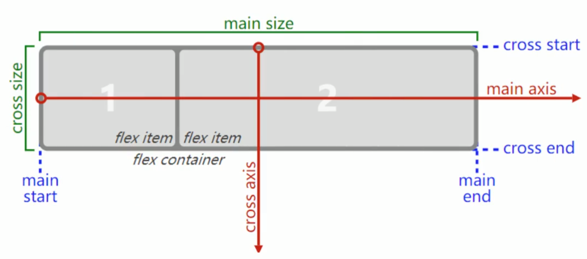

## 以后做布局flex一定是用的最多的！！！

### 1. 认识flex布局

目前web来发中使用最多的布局方案，弹性布局。

- 目前特别在移动端用的最多。

两个重要的概念：

- 开启了flex布局的元素叫flex container
- flex container 里面的直接子元素叫做flex items

**一般flex container上的属性用的比较多，flex items上的属性用的相对少一些。**

设置display属性为flex或者inline-flex可以成为flex container

- flex: flex container以block-level形式存在
- inline-flex: flex container以inline-level形式存在

### 2. flex布局模型

注：红色线为默认主轴 和 交叉轴方向

flex container, flex item

主轴：main axis

main size, main start, main end

交叉轴：cross axis

cross size, cross start, cross end

### 3. flex相关的属性

**应用在flex container上CSS属性**

- flex-flow
- flex-direction
- flex-wrap
- justify-content
- align-items
- align-content

**应用在flex items上的CSS属性**

- flex
- flex-grow
- flex-basis
- flex-shrink
- order
- align-self

### 4. flex container相关属性

**总结：关于多justify-content、align-items、align-content的个人理解，首先对齐包含首先要有三个要素：方向、container、item**

|                 | 方向       | container  | item      |
| --------------- | ---------- | ---------- | --------- |
| justify-content | main axis  | 行         | flex item |
| align-items     | cross axis | 行         | flex item |
| align-content   | cross axis | corss axis | 行        |

#### 1. flex-direction

flex items默认都是沿着 main axis（主轴）从main start开始往main end方向排布

flex-direction决定了main axis的方向的，有4个取值

- row（默认值）、row-reverse、column、column-reverse

#### 2. justify-content

justify-content决定了flex items在main axis上的对齐方式

- flex-start（默认值）：与main axis对齐
- flex-end：与main end对齐
- center：居中对齐
- space-between：
  - flex items之间饿距离相等
  - 与main start、main end两端对齐
- space-evenly：
  - flex items之间的距离相等
  - flex items与main start、main end之间的距离等于flex items之间的距离
- space-around:
  - flex items之间的距离相等
  - flex items与main start、main end之间的距离是flex items之间距离的一半

#### 3. align-items

**align-items决定了flex items在cross axis上的对齐方式。**（normal、stretch用的不多）

- normal: 在弹性布局中，效果和stretch一样
- stretch: 当flex items在cross axis方向的size为auto时，会自动拉伸至填充flex container（前提是没有给flex items设置高度，如果flex items设置了高度，则不进行拉伸）
- flex-start: 与cross start对齐
- flex-end: 与cross end对齐
- center: 居中对齐
- baseline: 与基准线对齐， 这里的基线是flex container中第一行文本的基线。

#### 4. flex-wrap

wrap（包裹的意思）

**默认情况下，所有的flex items都会在同一行显示。**

**flex-wrap决定了flex container是单行还是多行**

- nowrap（默认）：单行
- wrap：多行
- wrap-reverse：多行（对比wrap，cross start与cross end相反，也就是说行在交叉轴上做了一个反转）用的非常少

#### 5. flex-flow

flex-flow是flex-direction || flex-wrap的简写

#### 5. align-content

**align-centent决定了`多行`flex items在cross axis上的对齐方式，用法与justify-content类似**。一般是用在多行显示时才使用。主要在单行时align-items和align-content可以达到同样的效果。

- stretch（默认值）：与align-items的stretch类似，如果flex items有设置具体高度/宽度，则不进行拉伸。**用的很少**
- flex-start：与cross start对齐
- flex-end：与cross end对齐
- center：居中对齐
- space-between
  - flex items之间的距离相等
  - 与cross start、cross end两端对齐
- space-around
  - flex-items之间的距离相等
  - flex-items与cross start、cross end之间的距离是flex items之间距离的一般
- space-evenly
  - flex items之间的距离相等
  - flex items与cross start、cross end之间的距离等于flex items之间的距离

### 5. flex items相关属性

#### 1. order 用的不多

**order 决定了flex items的排布顺序**

- 可以设置任意整数（正整数、负整数、0）值越小越排在前面
- 默认值是0

#### 2. align-self [用的不多]

align-self会覆盖flex container的align-items属性值。所以align-selft的取值是和flex container的align-items取值是一样的。

flex items可以通过align-self覆盖flex container设置的align-item

- auto（默认值）：遵循flex container的align-items设置
- stretch、flex-start、flex-end、center、baseline，效果更align-items一致

#### 3. flex-grow

grow（成长，长大，大大大）

**flex-grow决定了flex items如何扩展**

- 可以设置任意非负数字（正小数、正整数、0），默认值是0
- 当flex container在main axis方向上有剩余size时，flex-grow属性才会有效果

**如果所有flex items的flex-grow总和sum超过1，每个flex-item扩展的size为**

- flex-container的剩余宽度size * (flex-grow / sum)

如果所有flex items的flex-grow总和sum小于1，剩余空间不会分完。

flex items扩展后的最终size不能超过max-width/max-height

#### 4. flex-shrink

shrink（收缩）

**flex-shrink决定了flex items如何收缩**

- 可以设置任意非负数字（正小数、正整数、0），默认值是1
- 当flex items在main axis方向上超过了flex container的size，flex-shrink属性才会有效

**如果所有flex items的flex-shrink总和超过1，每个fiex item收缩的size为**

- flex items超过flex container的size * (收缩比例 / 所有flex items搜索的size之和)

**如果所有flex items的flex-shrink总和不超过1，每个fiex item收缩的size为**

- flex items超过flex container的size * (收缩比例 / 所有flex items搜索的size之和)
- 收缩比例 = flex-shrink * flex item的base size
- base size 就是flex item放入flex container之前的size

**注**：总和不超过1的情况很少使用哦。

**flex items收缩后的最终size不能小于min-width/min-height**

#### 5. flex-basis [用的不多]

**flex-basis用来设置flex items在main axis方向上的base size**

- auto（默认值）、具体的宽度值（100px）

**决定flex items最终的base size的因素，从优先级高到低**

- max-width/max-height/min-width/min-height
- flex-basis
- width/height
- 内容本身的size

#### 6. flex

**flex是flex grow || flex-shrink || flex-basis的简写，flex属性可以指定1个，2个或3个属性。**

- 单值语法：值必须为以下其中之一：
  - 一个无单位数（number）：它会被当做`<flex-grow>`的值。
  - 一个有效的宽度（width）值：它会被当做`<flex-basis>`的值。
  - 关键字none，auto或initial。
- 双值语法，第一个值必须是一个无单位数，并且它会被当做`<flex-grow>`的值。
  - 第二个值必须为一下之一：
    - 一个无单位树：他会被当做`<flex-shrink>`的值。
    - 一个有效的宽度值：他会被当做`<flex-basis>`的值。