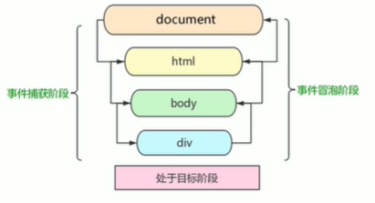

## 目标

1. 能够写出元素注册事件的两种方式
2. 能够说出删除事件的两种方式
3. 能够说出DOM事件流的三个阶段
4. 能够利用事件对象完成跟随鼠标案例
5. 能够分装组织冒泡的兼容性函数
6. 能够说出事件委托的原理
7. 能够说出常用的鼠标和键盘事件

##  1. 注册事件 （绑定事件）

### 1.1 注册事件概述

两种方式：传统方式、方法监听注册方式

**传统注册方式**

- 利用on开头的事件 onclick
- btn.onclick = function() {}
- 特点：注册事件的唯一性：同一个元素同一个事件只能设置一个处理函数，最后注册的处理函数将会覆盖前面注册的处理函数。

**方法监听注册方式**

- W3C标准推荐方式
- addEventListener()它是一个方法
- IE9之前的IE不支持此方法，可使用attachEvent()代替
- 同一个元素同一个事件可以注册多个监听器
- 按注册顺序执行

### 1.2 addEventListener事件监听方式

`eventTarget.addEventListener(type, listener[, useCapture])`

三个参数：

- type，事件类型字符串，比如click、mouseover，注意这里不要带on
- listener：事件处理函数，事件发生时，会调用该监听函数
- useCapture：可选参数，后面讲

### 1.3 attachEvent事件监听方式 不提倡使用了

IE9以前独有

`eventTarget.attachEvent(eventNameWithOn, callback)`

### 1.4 注册时间兼容性解决方案【仅了解】

兼容性处理的原则：首先照顾大多数浏览器，在处理特殊浏览器

```JavaScript
function addEventListener(element, eventName, fn) {
      if (element.addEventListener) {
        element.addEventListener(eventName, fn)
      } else if (element.attchEvent) {
        element.attchEvent('on' + eventName, fn)
      } else {
        element['on' + eventName] = fn;
      }
    }
```

## 2. 删除事件（解绑事件）

### 2.1 删除事件的方式

element.onclick = null

### 2.2 方法监听注册方式

eventTarget.removeEventListener(type, listener[, useCapture])

此时在初始事件时不能直接使用匿名函数。

eventTarget.detachEvent(eventNameWithOn, callback)

## 3. DOM事件流

事件发生时会在元素节点之间按照特定的顺序传播，这个转播过程即DOM事件流。

先捕获，后冒泡。

DOM事件流分为3个节点：

1. 捕获阶段
2. 当前目标阶段
3. 冒泡阶段



**注意**

1. js代码只能执行捕获或者冒泡其中的一个阶段。
2. onclick和attachEvent只能得到冒泡阶段
3. addEventListener(type, listener[, useCapture])第三个参数如果是true，表示在事件捕获阶段调用事件处理程序；如果false，表示在事件冒泡阶段调用事件处理程序。
4. 实际上开发中我们很少使用事件捕获，**我们更关注事件冒泡**。
5. 有些事件是没有冒泡的，比如：onblur、onfocus、onmouseenter、onmouseleave。
6. 事件冒泡有时候会带来麻烦，有时候又会帮助我们很巧妙的某些事情。

## 4. 事件对象

事件对象也有兼容性问题 ie678通过 window.event

### 4.2 事件对象的使用语法

当我们注册事件时，event对象就会被系统自动创建，并依次传递给事件监听器（事件处理函数）

### 4.4 事件对象的常见属性和方法

| 事件对象属性方法    | 说明                                                         |
| ------------------- | ------------------------------------------------------------ |
| e.target            | 返回触发事件的对象，标准                                     |
| e.srcElement        | 返回触发事件的对象，非标准 ie6-8使用                         |
| e.type              | 返回事件的类型，比如click mouseover 不带on                   |
| e.cancelBubble      | 该属性阻止冒泡，非标准 ie6-8使用                             |
| e.returnValue       | 该属性阻止默认事件行为，非标准 ie6-8使用，比如不让链接跳转。 |
| e.preventDefault()  | 该属性阻止默认事件行为，标准，比如不让链接跳转。             |
| e.stopPropagation() | 阻止冒泡，标准                                               |

e.target和this有时会相等，注意：this是绑定事件的对象，而触发事件的对象可能this的子元素。

区别：e.target点击了那个元素，就返回那个元素；this是哪个元素绑定了这个事件，就返回哪个元素。而e.currentTarget和this相等。

使用`return false`也能够阻止默认行为，这个方法只适用低版本浏览器。

## 5. 阻止事件冒泡

### 5.1 阻止事件冒泡的两种方式

- 标准写法：利用事件对象里面的stopPropagation()方法
  - e.stopPropagation()
- 非标准写法：IE6-8利用事件对象cancelBubble属性
  - e.cancelBubble = true

## 6. 事件委托（代理、委派）

原理：

不要给每个子节点单独设置事件监听器，二是事件监听器设置在其父节点上，然后利用冒泡原理影响设置每个子节点。

事件委托的作用：

我们只操作了一次DOM，提高了程序的性能。

## 7. 常用的鼠标事件

| 鼠标事件    | 触发条件 |
| ----------- | -------- |
| onclick     |          |
| onmouseover | 鼠标经过 |
| onmouseout  | 鼠标离开 |
| onfocus     |          |
| onblur      |          |
| onmousemove |          |
| onmouseup   |          |
| onmousedown |          |

### 7.1 常用的鼠标事件

1. 禁止鼠标右键菜单：

contextmenu菜单主要控制应该何时显示上下文菜单，主要用于程序员取消默认的上下文菜单。

2. 禁止鼠标选中 （selectstart 选中）

### 7.2 鼠标事件对象

鼠标事件对象：MouseEvent

键盘事件对象：KeyboardEvent

| 鼠标事件对象 | 说明                                  |
| ------------ | ------------------------------------- |
| e.clientX    | 返回鼠标相对于浏览器窗口可视区的X坐标 |
| e.clientY    | 返回鼠标相对于浏览器窗口可视区的Y坐标 |
| e.pageX      | 返回鼠标相对于文档页面的X坐标 IE9+    |
| e.pageY      | 返回鼠标相对于文档页面的Y坐标 IE9+    |
| e.screenX    | 返回鼠标相对于电脑屏幕的x坐标         |
| e.screenY    | 返回鼠标相对于电脑屏幕的y坐标         |

开发中比较常用的e.pageX和e.pageY

## 8. 常用的键盘事件

### 8.1 常用键盘事件

| 键盘事件   | 触发条件                                                     |
| ---------- | ------------------------------------------------------------ |
| onkeyup    | 某个键盘按键被松开时触发                                     |
| onkeydown  | 某个键盘按键被按下时触发                                     |
| onkeypress | 某个键盘按键被按下时触发，但是它不能识别功能键比如 ctrl shift 箭头等。 |

三个事件的执行顺序：keydown -> keypress -> keyup

### 8.2 键盘事件对象

keyup和keydown事件不区分字母大小写，a和A得到的keyCode都是65

keypress区分字母大小写。

注意：onkeydown和onkeyup不区分字母大小写，onkeypress区分字母大小写。在我们实际开发中，我们更多的使用keydown和keyup，它能识别所有的键（包括功能键）。keypress不识别功能键，但是keyCode属性区分大小写，返回不同的ASCII值。

注意：keydown和keypress在文本框里面的特点：它们两个事件触发的时候，文字还没有落入文本框中。

keyup事件触发的时候，文字已经落入文本框里面了。