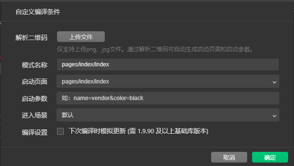

若要开发一个典型的微信小程序，应掌握的基础知识包括项目的基本架构、常用组件的使用、页面样式的编写、事件处理函数、数据绑定，以及条件渲染和列表渲染的语法。

### 2.1 【案例1】比较数字大小

#### 2.1.1 案例分析

#### 2.1.2 创建项目

`<input>`属于单边标签，只有开始标签，且结尾用“/>”表示。

input组件的type属性：

| 可选值 | 说明               | 默认 |
| ------ | ------------------ | ---- |
| text   | 文本输入键盘       | 是   |
| number | 数字输入键盘       |      |
| idcard | 身份证输入键盘     |      |
| digit  | 带小数点的数字键盘 |      |

#### 2.1.3 页面组件

小程序中使用WXML（WeiXin Markup Language）来实现页面的结构。

#### 2.1.4 页面样式

WXSS（WeiXin Style Sheets）是一套样式语言用于描述，WXML的组件样式。WXSS具有CSS大部分特性，并在CSS基础上做了一些扩充和修改。

**2.尺寸单位**

在使用CSS进行移动端开发的网页开发时，由于不同手机设备的屏幕有不同的宽度和设备像素比，在换算像素单位时会遇到很多麻烦。为了方便开发人员适配各种手机屏幕，微信小程序在WXSS中加入了新的尺寸单位rpx（responsive pixel，响应式像素）。

移动端网页像素单位的换算难点在于它有物理像素和逻辑像素两种单位，物理像素是指屏幕上实际有多少个像素，而逻辑像素是指CSS中使用的像素单位。例如iPhone 6手机的物理分辨率为750px*1334px，逻辑分辨率为375px * 667px，经过换算可知，1个逻辑像素需要2 * 2个物理像素。

为了方便换算，rpx单位规定了任何手机屏幕的宽度都为750rpx（逻辑像素），由小程序内部负责将逻辑像素转换为当前手机的物理像素。

**3.样式导入**
在WXSS中可以使用@import语句导入外联样式表，在@imput后面斜向需要导入外联样式表的路径即可，可用“;”表示语句结束。

**4.全局样式**

可以在根目录下创建全局样式文件app.wxss，将公共的样式写在全局样式文件中。

值得一提的是，当公共样式文件（app.wxss）和页面样式文件（pages/index/index.wxss）发生样式冲突时，页面样式的优先级高，会覆盖公共样式。

#### 2.1.5 配置文件

小程序的每一个页面均可使用json文件对页面的效果进行配置。页面配置分为页面级和应用级。

**1.页面级配置文件**

常用的页面级配置：

| 属性                         | 说明                                                         |
| ---------------------------- | ------------------------------------------------------------ |
| navigationBarBackgroundColor | 导航栏背景颜色                                               |
| navigationBarTextStyle       | 导航栏标题颜色，仅支持black white                            |
| navigationBarTitleText       | 导航栏的标题文字内容                                         |
| backgroundColor              | 窗口的背景颜色                                               |
| backgroundTextStyle          | 下拉loading的样式，仅支持dark、light                         |
| enablePullDownRefresh        | 是否全局开启下拉刷新，默认为false                            |
| onReachBottomDistance        | 页面上拉触底事件触发时距离页面底部距离（单位为px），默认为50 |
| disableScroll                | 默认为false，设为true时，页面整体不能上下滚动                |

**2.应用级配置文件**

项目根目录下app.json就是应用级配置文件。

常用配置如下表：

| 属性                   | 说明                             |
| ---------------------- | -------------------------------- |
| pages                  | 页面路径列表                     |
| window                 | 全局的默认窗口表现               |
| tabBar                 | 底部tab栏的表现                  |
| networkTimeout         | 网络超时时间                     |
| requireBackgroundModes | 需要在后台使用的能力，如音乐播放 |
| debug                  | 是否开启调试模式，默认为false    |
| plugins                | 使用到的插件                     |

#### 2.1.6 页面逻辑

在如pages/index/index.js的文件中配置

Page()函数用来注册一个页面，该函数的参数是一个对象，通过该对象可以指定页面的初始数据、生命周期函数、事件处理函数等。具体如下表：

| 属性              | 类型     | 说明                                                         |
| ----------------- | -------- | ------------------------------------------------------------ |
| data              | Object   | 页面的初始数据                                               |
| onLoad            | Function | 生命周期回调函数，监听页面加载                               |
| onReady           | Function | 生命周期回调函数，监听页面初次渲染完成                       |
| onShow            | Function | 生命周期回调函数，监听页面显示                               |
| onHide            | Function | 生命周期回调函数，监听页面隐藏                               |
| onUnload          | Function | 生命周期回调函数，监听页面卸载                               |
| onPushDownRefresh | Function | 页面事件处理函数，监听用户下拉动作                           |
| onReachBottom     | Function | 页面事件处理函数，页面上拉触底                               |
| onShareAppMessage | Function | 页面事件处理函数，用户单击右上角的分享按钮                   |
| onPageScroll      | Function | 页面事件处理函数，页面滚动会连续触发                         |
| 其他              | Any      | 开发者可以添加任意的函数或者数据，在页面的函数中可以通过this.*来访问。 |

**1.声明周期回调函数**

执行顺序：

onLoad-->onShow-->onReady

- onLoad：页面加载时触发，一个页面只会调用一次。通过参数options可以获得打开当前页面路径中的参数。
- onReady：页面初次渲染完成的时候调用。一个页面只会调用一次，代表页面已经准备妥当，此时可以与视图层进行交互。
- onShow：当页面显示时触发。例如，从后台切入前台时触发。
- onHide：当页面隐藏时触发。例如，从前台切入后台时触发。
- onUnload：页面卸载时触发。例如，使用路由API中的wx.redirectTo()或wx.navigateBack()跳转其他页面时触发。

**2.页面事件处理函数**

**3.组件事件处理函数**

通过事件对象e，可以获取type（事件类型）、timestamp（事件生成时的时间戳）、target（触发事件的组件的一些属性值集合）、currentTaget（当前组件的一些睡醒值集合）、detail（额外的信息）等信息。

e.target获取到的是子元素的属性值集合，而e.currentTarget获取到的是父元素的属性值集合。

常用的冒泡事件：

| 事件类型    | 触发条件                                                     |
| ----------- | ------------------------------------------------------------ |
| touchstart  | 手指触摸动作开始                                             |
| touchmove   | 手指触摸后移动                                               |
| touchcancel | 手指触摸后动作被打断，如来电提醒、弹窗                       |
| touchend    | 手指触摸动作结束                                             |
| tap         | 手指触摸后马上离开                                           |
| longpress   | 手指触摸后，操作350ms再离开如果指定了事件回调函数并触发了这个事件，tap事件将不触发 |

事件绑定和冒泡：

在为主键绑定事件时，有两种方式，分别是“bind事件类型”和“catch事件类型”，bind方式的特点是不会阻止冒泡事件向上冒泡，而catch可以阻止冒泡事件向上冒泡。

#### 2.1.7 注册程序

若要在小程序启动、显示、隐藏时执行某些操作，可以通过App()函数来实现。App()函数用于注册小程序，它接收一个对象参数，通过参数指定小程序的生命周期回调等。

自定义编译条件可设置启动页面，启动参数等：

onLaunch回调options相关信息：

- path: 打开小程序的路径，一般情况下是app.json中的第1个路径，也可以通过自定义编译条件指定启动页面。
- query: 打开小程序的query，一般情况下是空对象，也可以通过自定义编译条件指定启动参数。
- scene: 打开小程序的场景值，一般情况下是1001，亦可以通过自定义编译条件指定进入场景。
- shareTicket：当小程序被转发出去时（如转发到群聊），如果此转发卡片被其他用户打开，可以获取到shareTicket（如群的标识）。通常搭配wx.showShareMenu()使用，并且需要在该方法的参数对象中设置withShareTicket为true。
- referrerInfo: 当场景为从另一个小程序、公众号或APP打开时，可以通过它获取来源于小程序、公众号的的AppId等。scene为1037或1038时支持传递附加数据。

值得一提的是，利用App()函数还可以保存一些所有页面中共享的数据。

#### 2.1.8 实现比较功能

需要通过this.setData({...})来修改data中的属性。

**为两个input组件绑定相同事件处理函数**

通过id区分元素

通过dataset区分元素

wx:if、wx:elif、wx:else

如果希望控制一块区域是否出现则使用`<block>`标签会更加方便。`<block>`标签并不是一个组件，它仅仅是一个包装元素，不会在页面中做任何渲染，只接收控制属性。

form组件的bindsubmit属性用于绑定表单提交事件。在表单中，为两个input加上了name属性，表达提交时就会自动收集带有name属性的组件的值。

### 2.2 【案例2】调查问卷

#### 2.2.4 表单数据绑定

