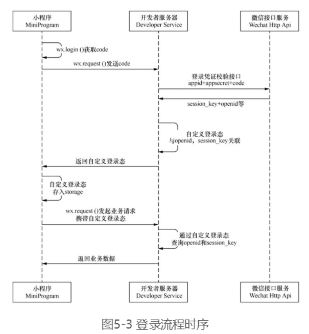

### 5.1 【案例1】用户登录

#### 5.1.1 案例分析

#### 5.1.2 前导知识

**1.用户登录流程**

小程序可以通过微信官方提供的登录能力，获取微信提供的用户身份标识，建立用户体系。

用户登录流程需要小程序、开发者服务器和微信接口服务3个角色的参与：

- 小程序：用户的客户端，由于小程序运行在微信之上，因此小程序可以通过API获取微信用户的身份信息。
- 开发者服务器：小程序的后端服务器，用于为小程序用户提供服务。
- 微信接口服务：微信为开发者服务器提供的接口。

（1）小程序获取code

在小程序内部通过wx.login()获取登录凭证code，code由小程序内部自动生成，每次调用wx.login()获得code都不同。需要注意的是，**code有效期为5分钟**，且被微信接口服务验证一次后就会失效。

（2）小程序将code发送给开发者服务器

在获取code，使用wx.request()将code发送给开发者服务器

（3）开发者服务器通过微信接口服务校验登录凭证

开发者服务器将AppId、AppSecret、code发送给微信接口服务校验登录凭证，如果校验成功，返回session_key和openid等。其中AppId是小程序的唯一标识，AppSecret是小程序的秘钥，对于微信接口服务而言，他们相当于小程序账号的id和密码。

微信接口服务校验成功后会返回session_key和openid，openid是用户的唯一标识，session_key是对用户数据进行加密签名的秘钥。需要注意的是openid并不等同于微信用户id，同一个微信用户在不同AppId小程序中的openid是不同的。



（4）开发者服务器自定义登陆台

在用户登录成功后，开发者服务器将openid和session_key保存，然后生成一个自定义登陆态的token（令牌）响应给小程序，通过token可以查询到openid和session_key。小程序下次请求时只要携带token，就可以证明用户已经登录。

**2.数据缓存**

在小程序中可以缓存一些数据，从而在小程序退出后再次打开时，可以从缓存中读取上次保存的数据。

常用的数据缓存API：

**异步：**

| 名称                | 说明                              |
| ------------------- | --------------------------------- |
| wx.setStorage()     | 将数据存储在本地缓存中指定的key中 |
| wx.getStorage()     | 从本地缓存中异步获取指定key的内容 |
| wx.getStorageInfo() | 异步获取当前storage的相关信息     |
| wx.removeStorage()  | 从本地缓存中移除指定key           |

同步版本：

| 名称                    | 说明                              |
| ----------------------- | --------------------------------- |
| wx.setStorageSync()     | 将数据存储在本地缓存中指定的key中 |
| wx.getStorageSync()     | 从本地缓存中异步获取指定key的内容 |
| wx.getStorageInfoSync() | 异步获取当前storage的相关信息     |
| wx.removeStorageSync()  | 从本地缓存中移除指定key           |

#### 5.1.3 搭建开发者服务器

#### 5.1.4 实现用户登录

#### 5.1.5 检查用户是否已经登录

小程序登录成功后，已经将服务器返回的token保存在数据缓存中了。下次启动小程序时，应该判断数据缓存中是否存在token，如果存在存在，直接取出这个token即可，不在用执行登录操作。需要注意的是，token有可能会过期，需要重新登录，这就需要在从数据缓存中取出token后，先验证token是否过期，再使用token。

#### 5.1.6 获取用户信息

小程序中，获取用户信息有两种常用的方式，一种是使用`<open-data>`组件，它不需要用户授权，就可以显示用户的头像、昵称、性别等信息，适合只用来展示的情况。另一种方式是通过单击按钮，提示用户授权，获取到用户信息数据。

为按钮设置的open-type属性，用于访问微信开放能力，值为getUserInfo，表示获取用户信息。设置该属性后，按下按钮时会弹出微信授权提示。

在小程序的早期版本中，微信授权提示是通过wx.getUserInfo()弹出的，如果在小程序启动时就通过wx.getUserInfo()申请权限，用户体验会大打折扣。因此，在新版本中，授权提示需要用户主动按下按钮后才会弹出。

在为按钮添加open-type属性后，还需要通过bindgetuserinfo属性绑定getUserInfo()回调函数，然后在函数中使用e.detail.userinfo获取用户信息。如果用户按下“允许”按钮，则可以获取用户信息，如果用户按下“拒绝”按钮，则获取不到用户信息。

在用户已经授权后，授权数据会被记录下载，下次启动小程序时无需再次申请授权。若要在启动时判断是否已经授权，可以在app.js的onLaunch()通过如下代码获取：

```javascript
wx.getSetting({
      success: res => {
        if (res.authSetting['scope.userInfo']) {
          console.log('已取得用户信息授权');
          // 执行到此处表示用户已经授权，可以直接获取到用户信息
          wx.getUserInfo({
            lang: 'zh_CN',
            success: res => {
              console.log(res.userInfo);
            }
          })
        }
      }
    });
```

wx.getSetting()用于获取用户的当前设置，可以获取到小程序已经向用户请求过的权限；res.authSetting[]数组保存了用户授权结果；res.authSetting['scope.userInfo']表示是否授权了用户信息，值为 true 或 false。当用户信息授权后，通过wx.getUserInfo()可以获取用户信息，保存在res.userInfo中。

#### 5.1.7 开放数据校验与解密

如果开发者服务器想要获取用户信息，则需要在小程序端通过wx.request()将获取到的信息发送给开发者服务器。

小程序提供了开放数据的校验和解密机制。

得到用户的“允许”授权后，可以通过wx.getUserInfo()获取用户信息，包含如下字段：

- errMsg：错误信息
- userInfo：用户信息对象，不包含openid等敏感信息。
- rawData: 不包括铭感信息的原始数据字符串，用于计算签名。
- signature: 使用sha1(rawData + session_key)得到字符串，用于校验用户信息。
- encryptedData: 包括敏感数据在内的完整用户信息的加密数据。
- iv: 加密算法的初始向量。

**注意**
session_key是用户的会话密钥，需要存储在服务器中，调用获取用户信息等危险接口时，需要用这个会话秘钥，才能解密获取相关信息。为了应用自身的数据安全，开发者服务器不应该把session_key下发到小程序，也不应该对外提供个这个密钥。小程序每次调用wx.login()时，会自动生成新的session_key，导致原来的session_key实效。如果需要检查session_key是否失效，可以通过wx.checkSession()进行检查。

### 5.2 【案例2】个人中心

#### 5.2.1 案例分析

首页和个人中心

本案例重点讲解小程序的3中页面跳转方式。

- 标签页与标签页之间的跳转
- 标签页与非标签页之间的跳转
- 非标签页与非标签页之间的跳转

#### 5.2.2 前导知识

##### 1. wx.switchTab

wx.switchTab用于跳转页面，且只能跳转到tabBar页面。并关闭其他所有非tabBar页面。

wx.switchTab常用属性：

| 属性     | 类型     | 说明                                                         |
| -------- | -------- | ------------------------------------------------------------ |
| url      | string   | 需要跳转的tabBar页面的路径（需要在app.json的tabBar字段定义的页面），路径后不能带参数 |
| success  | function |                                                              |
| fail     | function |                                                              |
| complete | function |                                                              |

##### 2. wx.nevigateTo和wx.redirectTo