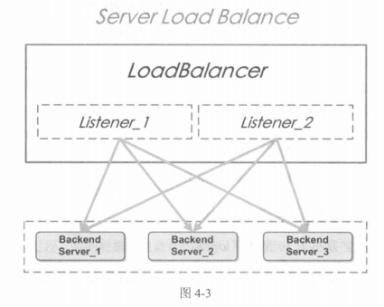

## 第4章 更好的Node.js

### 4.1 选择

#### 4.1.1 语法可难可易

进阶的3个阶段分别是面向过程、面向对象和函数式编程。

**面向过程**

如果想让代码更加优雅，我们可以使用Koa框架。

**面向对象**

如果说非要使用面向对象的写法，一般都会使用更好的转译器TypeScript。

**函数式编程**

代码漂亮，抽象程度高。

如果在团队中应用，还是要谨慎选择，持观望态度，原因有两个：一是学习成本高，二是维护成本高。

#### 4.1.2 开发大型软件

- 关于测试
- 关于代码质量和规范
- 关于构建，由其推荐Gulp
- 生成器
- 包管理工具

#### 4.1.3 特定场景下的快速开发

### 4.2 单线程会“死”吗

如果了解用法，就不会出现单线程脆弱的问题。

#### 4.2.1 uncaughtException

使用`process.on('uncaughtException', function(err) {})`就不会造成接口奔溃了。

#### 4.2.1 异常捕获

**注意：**

- Node.js里约定，同步代码才能捕获异常，异步代码不能直接使用try/catch
- 代码中都是try/catch也有弊端
- 使用try/catch成本较高，除非必要。

#### 4.2.3 forever

异常重启，现在大部分该用PM2

#### 4.2.4 小集群：单台服务器上多个实例

推荐使用PM2模块。

#### 4.2.5 大集群：多台机器

前端的所有请求都会落到负载层，由负载层转发到负载中可用节点的服务器上。如下图



”单线程会死“是一个伪命题，大部分时候是用法不当造成的。

### 4.3 为Node.js正名

#### 4.3.1 版本帝？

新版本相比于旧版本只增加了一些小的改进，而且是边边角角的改进，也就是说，Node.js的核心代码已经非常稳定了，可以大规模使用。

#### 4.3.2 已无性能优势？

#### 4.3.3 异步和回调地狱

推荐async函数作为Node.js作为异步解决方案。

异步流程控制是Node.js编程的核心。

#### 4.3.4 技术栈演进

大家要重视面向对象写法的使用，面向对象对于大型软件开发更适合。

### 4.4 更好的实践

#### 4.4.1 ES.next

**转译工具**

Babel: 最流行的ES6到ES5的转译器。

**语法说明及必会要点**

1. call和apply

call和apply都是为了改变某个函数运行时的context（上下文）而存在的，换句话说，就是为了改变函数体内部this的指向而存在的。call第第二个参数为不定参数，apply的第二个参数为数组形式，函数会自动将数组展开。

2. bind

bind方法创建了一个新的函数，当函数被调用时，会将this关键字设置为提供的值，调用新函数时，会在方法调用之前提供一个给定的参数序列。

3. Object.defineProperty

它对于MVVM框架中的双向数据绑定（two-ways data binding）来说是至关重要的。

4. delegate

在JavaScript里，可以将一个对象的方法、属性等委托给另一个对象。

5. only

only是一个Node.js模块，用于返回对象的白名单属性，尤其适用于“类的方法非常多但只想暴露部分属性”的情况。

#### 4.4.2 类型系统

动态类型一时爽，代码重构火葬场。

长远来看，TypeScript应该是真正的赢家。

#### 4.4.3 更好的npm替代品——Yarn

```shell
$ npm install --global yarn
$ yarn init
$ yarn add [package]
$ yarn add [package]@[version]
$ yarn add [package]@[tag]
$ yarn upgrade [package]
$ yarn upgrade [package]@[version]
$ yarn upgrade [package]@[tag]
$ yarn remove [package]
$ yarn
$ yarn install
```

#### 4.4.4 多模块管理器Lerna

Lerna是专门用于管理Node.js多模块的工具。

